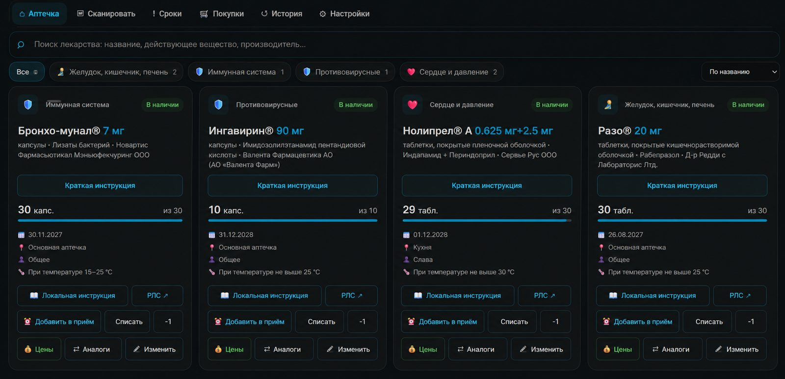

<p align="center">
  
</p>

<h1 align="center">Medicine Cabinet / Домашняя аптечка</h1>

<p align="center">
  Учёт домашней аптечки, физических упаковок, сроков годности, остатков и мест хранения прямо в Home Assistant.
</p>

<p align="center">
  
  
  
  
</p>

**Medicine Cabinet** — пользовательская интеграция Home Assistant с отдельной адаптивной панелью для домашней аптечки. Она хранит каждую физическую упаковку отдельно, умеет работать с Data Matrix / GS1, учитывать фактический срок годности и остаток, контролировать серийные номера, хранить места размещения и связываться с Medication Manager.

> [!IMPORTANT]
> Интеграция предназначена для домашнего учёта и справочной информации. Она не является медицинским изделием и не заменяет инструкцию производителя, врача или фармацевта.

## 📷 Интерфейс

### Десктоп

<p align="center">
  
</p>

### Телефон

<p align="center">
  
</p>

> Интерфейс активно развивается, поэтому отдельные элементы на скриншотах могут немного отличаться от текущей версии.

## 🚀 Возможности

| Возможность | Что делает |
|---|---|
| 📦 **Физические упаковки** | Каждая коробка учитывается отдельно со своим сроком, остатком, серией и местом хранения |
| 📱 **Data Matrix / GS1** | Сканирование через Home Assistant Companion App, поддержка GTIN/EAN и GS1 AI |
| 🧾 **Контроль серийного номера** | Повторное добавление одной и той же упаковки блокируется по серийному номеру |
| 📅 **Фактический срок годности** | Если Data Matrix содержит GS1 AI `(17)`, дата заполняется автоматически |
| 📍 **Места хранения** | Быстрый выбор: Основная аптечка, Кухня, Комод, Шкаф Таня + свои варианты |
| 📊 **Остатки** | Количество в упаковке, текущий и минимальный остаток, защищённое списание |
| 🧭 **Категории** | Автоматическая группировка по АТХ / назначению |
| 📚 **РЛС** | Локальная база для поиска и инструкций + переход на актуальную страницу RLSnet.ru |
| 📝 **Краткая инструкция** | Компактная кнопка на карточке и отдельное popup-окно с обновлением и ручной правкой |
| 🔎 **Аналоги** | Локальный поиск по действующему веществу и АТХ |
| 💰 **Цены** | Поиск цен и наличия в поддерживаемых аптечных сетях |
| 👤 **Пациенты** | Список пациентов из Medication Manager + «Общее» |
| 💊 **Medication Manager bridge** | Связанный график использует Medicine Cabinet как источник остатка; подтверждение приёма уменьшает запас FEFO |
| 🛒 **Покупки и история** | Отдельные разделы панели для покупок, сроков и истории движения |
| 🌙 **Адаптивная панель** | Телефон, планшет и десктоп; светлая/тёмная тема Home Assistant |

## ✨ Что нового в 0.4.4

- поле **«Место хранения»** стало выпадающим списком;
- базовые места: **Основная аптечка**, **Кухня**, **Комод**, **Шкаф Таня**;
- через **«＋ Добавить другое место…»** можно сохранить собственное место для всех карточек;
- список мест доступен и в разделе **Настройки**;
- добавлена двойная защита от дубликатов по **серийному номеру** — на этапе сканирования и при сохранении backend;
- обновлены локальные иконки интеграции;
- сохранены компактные карточки, кнопка **Правка**, подтверждение **Списать** и **−1**.

Полная история изменений: [CHANGELOG.md](CHANGELOG.md).

## 📦 Установка через HACS

1. Откройте **HACS → Интеграции**.
2. Нажмите **⋮ → Пользовательские репозитории**.
3. Добавьте:

```text
https://github.com/asustek1978/Medicine-Cabinet
```

4. Категория: **Integration**.
5. Найдите **Home Medicine Cabinet** и установите.
6. **Полностью перезапустите Home Assistant**.
7. Откройте **Настройки → Устройства и службы → Добавить интеграцию**.
8. Выберите **Домашняя аптечка**.

После настройки в боковой панели Home Assistant появится отдельный пункт аптечки.

## 📁 Ручная установка

Скопируйте:

```text
custom_components/medicine_cabinet/
```

в:

```text
/config/custom_components/medicine_cabinet/
```

После копирования полностью перезапустите Home Assistant и добавьте интеграцию через UI.

## 🗃️ Локальный каталог лекарств

Для быстрого локального поиска интеграция использует:

```text
/config/medicine_cabinet/medicine_catalog.sqlite
```

Каталог создаётся **локально у пользователя** из установленной базы «Энциклопедия лекарств РЛС» с помощью:

```text
tools/convert_rls.py
tools/build_catalog.bat
```

Подробная инструкция: [docs/RLS_CATALOG.md](docs/RLS_CATALOG.md).

> [!NOTE]
> Репозиторий **не содержит и не распространяет** исходные базы РЛС или готовый `medicine_catalog.sqlite`. Условия использования исходных данных определяются правообладателем РЛС.

## 🔍 Как работает сканирование

```text
Data Matrix / штрихкод
        ↓
GS1 / GTIN / EAN / serial
        ↓
проверка serial на дубликат
        ↓
medicine_catalog.sqlite
        ↓
карточка конкретной упаковки
        ↓
срок + остаток + место + пациент
        ↓
Домашняя аптечка
```

Если Data Matrix содержит AI `(17)`, интеграция использует его как фактический срок конкретной упаковки. Справочный срок хранения из каталога не подменяет дату, напечатанную на упаковке.

## 📍 Места хранения

По умолчанию доступны:

```text
Основная аптечка
Кухня
Комод
Шкаф Таня
```

В форме упаковки выберите **«＋ Добавить другое место…»**, введите название — оно сохранится и станет доступно в выпадающем списке для остальных упаковок.

## 🧾 Защита от дубликатов

Для GS1/Data Matrix упаковок с серийным номером интеграция нормализует serial и проверяет его среди уже сохранённых упаковок.

Если serial уже существует:

- новая упаковка не сохраняется;
- интерфейс показывает, какой препарат уже зарегистрирован;
- дополнительно отображается его место хранения;
- backend повторно проверяет serial, поэтому обход проверки интерфейса не создаст дубль.

Пустой серийный номер не считается дубликатом.

## 💊 Medication Manager

При установленном совместимом Medication Manager упаковку можно связать с графиком приёма. Medicine Cabinet остаётся источником фактического остатка.

При подтверждении **«Принял»** запас уменьшается по FEFO: сначала используется подходящая непросроченная упаковка с ближайшим сроком годности, затем следующая.

## 🔐 Приватность и безопасность

- домашние остатки хранятся локально в Home Assistant;
- каталог РЛС создаётся и хранится локально;
- репозиторий не содержит персональные данные, токены или ваши базы лекарств;
- внешние запросы выполняются только для функций, которым нужна актуальная веб-информация (например, RLSnet.ru и цены);
- перед списанием через **Списать** и **−1** требуется подтверждение.

## 🧪 Проверка проекта

В репозитории включены GitHub Actions:

- **HACS validation**;
- **Home Assistant hassfest**.

Workflow: `.github/workflows/validate.yml`.

## 🐛 Ошибки и предложения

Используйте [Issues](https://github.com/asustek1978/Medicine-Cabinet/issues):

- **Bug report** — если что-то не работает;
- **Feature request** — для новых функций.

При ошибке приложите версию Home Assistant, версию Medicine Cabinet, шаги воспроизведения и журнал без секретов/персональных данных.

## 📄 Лицензия

MIT License. См. [LICENSE](LICENSE).
